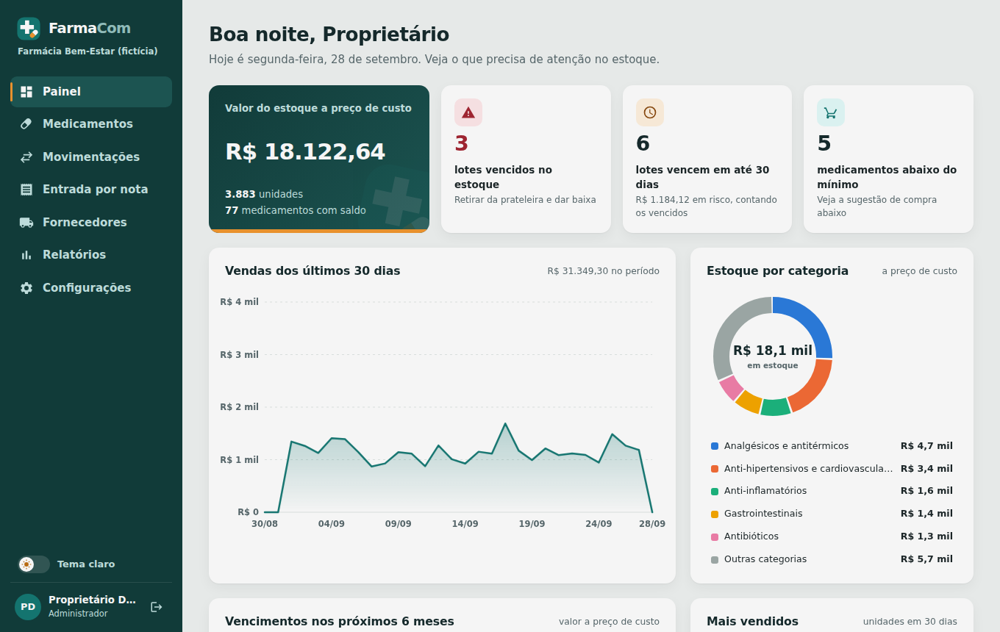
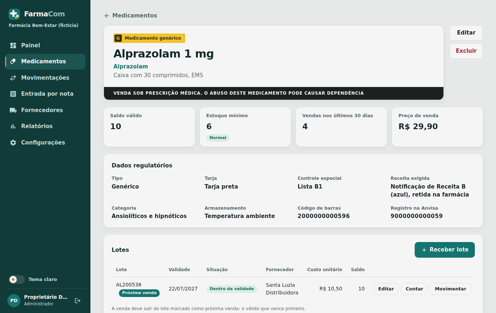

# FarmaCom

Sistema web de controle de estoque e validade para farmácias de bairro, desenvolvido no Desafio Unifacisa (Análise e Desenvolvimento de Sistemas).



## O que o sistema faz

- Cadastro de medicamentos com tarja, tipo (referência, genérico ou similar), controle especial, código de barras, registro na Anvisa e preço
- Cadastro de fornecedores; cada lote fica ligado a quem entregou
- Entrada de lotes pelo XML da nota fiscal de compra (NF-e), com lote, validade e quantidade lidos da nota
- Lotes com validade e custo; a venda sai sempre do lote que vence primeiro
- Receita obrigatória na venda de controlados e antimicrobianos
- Estorno de movimentações e contagem de inventário com ajuste automático
- Painel com gráficos de vendas, estoque por categoria, vencimentos e mais vendidos
- Relatórios de perdas, movimentação, curva ABC e livro de controlados, em planilha ou PDF
- Geração do arquivo XML para o SNGPC da Anvisa, com conferência de pendências
- Aviso diário por e-mail ou WhatsApp com o que vence e o que está acabando (opcional)
- Perfis de administrador e atendente, tema claro e escuro e cor de destaque configurável

A pesquisa que orientou essas funcionalidades está em [docs/pesquisa.md](docs/pesquisa.md).



## Tecnologias

React com Vite na interface, Node.js com Express na API e PostgreSQL no banco.

## Como rodar

Precisa de Node.js 20 ou superior e de um PostgreSQL. Com Docker, na raiz do projeto:

```bash
docker compose up -d
```

API:

```bash
cd server
cp .env.example .env
npm install
npm run db:seed
npm run dev
```

Interface, em outro terminal:

```bash
cd web
npm install
npm run dev
```

Abra http://localhost:5173 e entre com `demo@farmacom.app` (administrador) ou `atendente@farmacom.app` (atendente), senha `farmacom123`. Os dados de exemplo são de uma farmácia fictícia. Para testar a entrada por nota, use o arquivo `web/public/nfe-exemplo.xml`.

## Avisos diários

Os avisos são ligados em Configurações. Os canais dependem de variáveis de ambiente na API (veja `server/.env.example`):

- E-mail: `SMTP_HOST`, `SMTP_PORT`, `SMTP_USER`, `SMTP_PASS` e `SMTP_FROM`
- WhatsApp: `WHATSAPP_API_URL`, `WHATSAPP_INSTANCIA` e `WHATSAPP_TOKEN` (Evolution API)

A API confere o horário a cada minuto. No plano gratuito do Render ela hiberna, então use um agendador externo (como o cron-job.org) chamando `GET /api/avisos/disparar?chave=AVISOS_CHAVE` uma vez por dia.

## SNGPC

O arquivo gerado em Relatórios segue a estrutura de entradas, saídas e perdas do SNGPC, mas precisa ser validado no ambiente de testes da Anvisa antes de qualquer transmissão real.

## Testes

```bash
cd server
npm test
```

## Publicação

A API e a interface estão no Render (configuração em `render.yaml`) e o banco no Neon. A cada envio para a `main`, o Render publica a nova versão e aplica as migrações do banco. Os dados de demonstração só são criados quando o banco está vazio.

## Equipe

- Guylherme Neves Pinheiro
- Gabriel Gaspar Mendes Bomfim
- João Guilherme Mendes Bomfim
