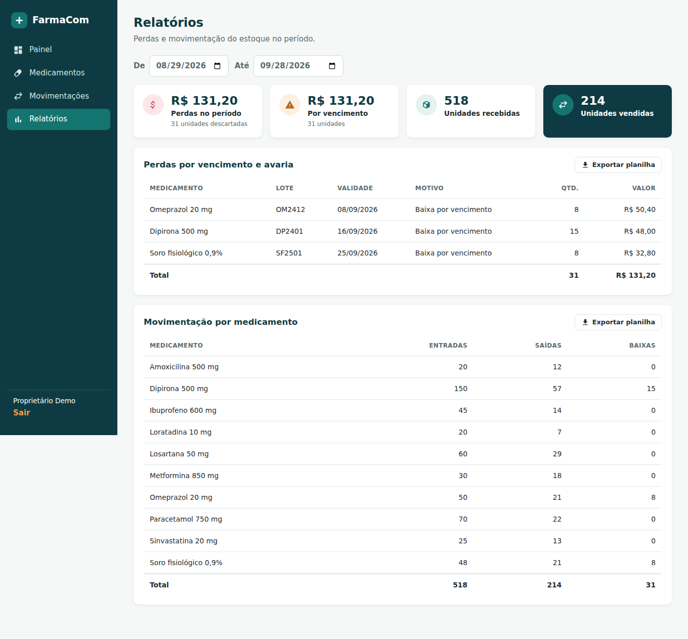

# FarmaCom

Sistema web de controle de estoque e validade para farmácias de bairro.

Projeto do **Desafio Unifacisa**, curso de Análise e Desenvolvimento de Sistemas. O FarmaCom avisa, no momento certo, o que está para vencer e o que está para acabar, e mostra quanto a farmácia perde com medicamentos vencidos.


## Funcionalidades do MVP

- **Cadastro de medicamentos e lotes**: nome, princípio ativo, fabricante, apresentação, estoque mínimo; cada lote com código, validade, fornecedor e custo unitário.
- **Entradas e saídas**: registro de entradas, vendas e baixas (por vencimento ou avaria), com saldo por lote e por medicamento.
- **Alertas de validade e de estoque**: painel com lotes vencidos e a vencer em 30, 60 ou 90 dias, medicamentos abaixo do mínimo e valor em risco.
- **Relatórios**: perdas por vencimento e avaria (em quantidade e em reais) e movimentação por medicamento, com exportação para planilha.
- **Regras de negócio protegidas no servidor**: não é possível vender mais que o saldo nem vender lote vencido (só dar baixa).
- **Login** com usuário e senha.

| Medicamento e lotes | Relatórios |
|---|---|
|  |  |

## Tecnologias

| Camada | Tecnologia |
|---|---|
| Interface | React 18 + Vite, React Router |
| Servidor (API) | Node.js 22 + Express |
| Banco de dados | PostgreSQL 16 |
| Autenticação | JWT + senhas com bcrypt |
| Validação | Zod |
| Testes | Node Test Runner + Supertest |
| Integração contínua | GitHub Actions (configuração em `docs/ci.yml`) |

## Como rodar no seu computador

Pré-requisitos: [Node.js 20 ou superior](https://nodejs.org) e PostgreSQL (pelo [Docker](https://www.docker.com) ou instalado direto).

### 1. Banco de dados

Com Docker, na raiz do projeto:

```bash
docker compose up -d
```

Sem Docker, crie no seu PostgreSQL o usuário `farmacom` (senha `farmacom`) e os bancos `farmacom` e `farmacom_test`.

### 2. Servidor (API)

```bash
cd server
cp .env.example .env
npm install
npm run db:seed     # cria as tabelas e os dados de exemplo
npm run dev         # API em http://localhost:3333
```

### 3. Interface

Em outro terminal:

```bash
cd web
npm install
npm run dev         # abra http://localhost:5173
```

**Acesso de demonstração:** `demo@farmacom.app` / `farmacom123`

Os dados de exemplo são de uma farmácia fictícia e usam datas relativas ao dia em que o comando é executado, então sempre há lotes vencidos, lotes a vencer e medicamentos com estoque baixo para demonstrar.

## Testes

```bash
cd server
npm test
```

Os testes usam o banco `farmacom_test` e cobrem login, validação de campos, cálculo de saldo, valores limite (saída igual ou maior que o saldo, alerta no último dia do prazo), bloqueio de venda de lote vencido e cálculo de perdas. Para rodá-los automaticamente no GitHub a cada envio de código, ative a integração contínua: no site do GitHub, crie o arquivo `.github/workflows/ci.yml` com o conteúdo de [`docs/ci.yml`](docs/ci.yml).

## Estrutura

```
farmacom/
├── server/                 API
│   ├── db/
│   │   ├── schema.sql      tabelas e visão de saldo
│   │   └── seed.js         dados de exemplo
│   ├── src/
│   │   ├── app.js          configuração do Express
│   │   ├── auth.js         login e proteção das rotas
│   │   └── routes/         medicamentos, lotes, movimentações, alertas, relatórios
│   └── test/               testes automatizados
├── web/                    interface
│   └── src/
│       ├── pages/          telas
│       └── components/     formulários e componentes visuais
├── docs/                   documentação e tarefas das Sprints
└── render.yaml             configuração de publicação no Render
```

## Rotas da API

Todas, exceto login e saúde, exigem o cabeçalho `Authorization: Bearer <token>`.

| Método | Rota | Descrição |
|---|---|---|
| POST | `/api/auth/login` | Login; devolve o token |
| GET | `/api/auth/eu` | Usuário logado |
| GET | `/api/medicamentos?busca=` | Lista com saldo e próxima validade |
| POST | `/api/medicamentos` | Cadastra medicamento |
| GET | `/api/medicamentos/:id` | Detalhe com lotes e saldos |
| PUT | `/api/medicamentos/:id` | Edita medicamento |
| DELETE | `/api/medicamentos/:id` | Exclui (só sem saídas ou baixas) |
| POST | `/api/medicamentos/:id/lotes` | Cadastra lote e entrada inicial |
| GET | `/api/lotes?medicamento_id=` | Lotes com saldo |
| PUT | `/api/lotes/:id` | Edita lote |
| GET | `/api/movimentacoes?limite=` | Últimas movimentações |
| POST | `/api/movimentacoes` | Registra entrada, saída ou baixa |
| GET | `/api/alertas?dias=` | Alertas de validade e de estoque baixo |
| GET | `/api/relatorios/perdas?inicio=&fim=` | Perdas no período |
| GET | `/api/relatorios/movimentacao?inicio=&fim=` | Movimentação no período |
| GET | `/api/saude` | Verificação de funcionamento |

## Publicação na internet

Sugestão gratuita: banco no [Neon](https://neon.tech) e servidor e interface no [Render](https://render.com).

1. **Neon**: crie um projeto e copie a *connection string* do banco.
2. **Render**: em *New > Blueprint*, escolha este repositório. O arquivo `render.yaml` cria os dois serviços.
3. Preencha as variáveis pedidas:
   - `farmacom-api` → `DATABASE_URL` com a connection string do Neon e `CORS_ORIGIN` com o endereço da interface (ex.: `https://farmacom-web.onrender.com`).
   - `farmacom-web` → `VITE_API_URL` com o endereço da API (ex.: `https://farmacom-api.onrender.com`).
4. A cada publicação, a API recria os dados de demonstração. No plano gratuito, ela "adormece" sem uso e demora cerca de um minuto para responder no primeiro acesso.

## Metodologia

O projeto segue uma abordagem ágil híbrida: **Sprints de duas semanas** (inspiradas no Scrum) para a linha do tempo e um **quadro Kanban** para as tarefas. Veja o fluxo de trabalho da equipe em [CONTRIBUTING.md](CONTRIBUTING.md) e as tarefas da Sprint em [docs/sprints.md](docs/sprints.md).

## Equipe

| Integrante | Responsabilidade |
|---|---|
| Guylherme Neves Pinheiro | Responsável pelo produto; regras de negócio e servidor |
| Gabriel Gaspar Mendes Bomfim | Facilitador do processo; interfaces e protótipos |
| João Guilherme Mendes Bomfim | Responsável pela qualidade; testes, banco de dados e publicação |
