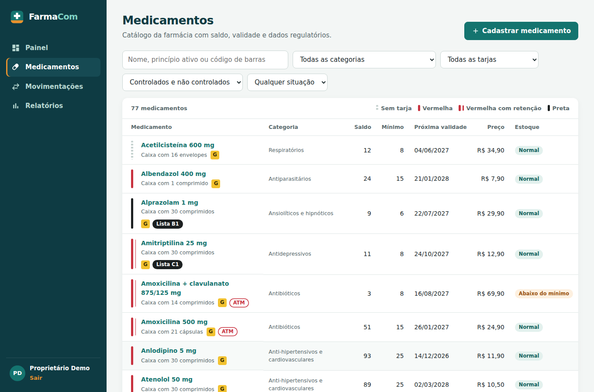
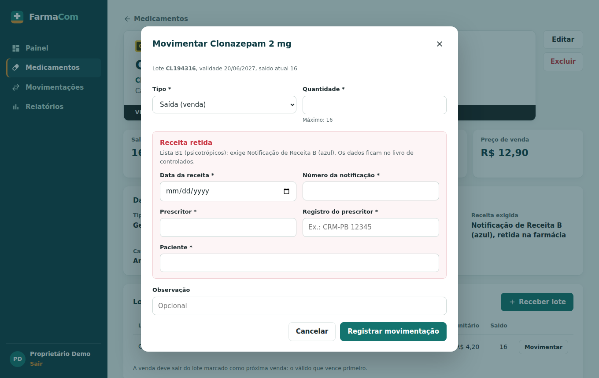

# FarmaCom

Sistema web de controle de estoque e validade para farmácias de bairro.

Projeto do **Desafio Unifacisa**, curso de Análise e Desenvolvimento de Sistemas. O FarmaCom avisa, no momento certo, o que está para vencer e o que está para acabar, e mostra quanto a farmácia perde com medicamentos vencidos.


## Funcionalidades

- **Catálogo com dados regulatórios**: 77 medicamentos comuns no Brasil na demonstração, com categoria, tipo (referência, genérico, similar), tarja, lista de controle especial (Portaria 344/98 e antimicrobianos), código de barras EAN-13, preço e indicação de armazenamento refrigerado.
- **Lotes e validade**: cada lote tem validade, fornecedor, custo e saldo próprios.
- **Venda pelo lote que vence primeiro (FEFO)**: o sistema sugere o lote e avisa quando outro é escolhido. Lote vencido não pode ser vendido, só baixado.
- **Receita retida para controlados e antimicrobianos**: a saída exige data da receita, prescritor, registro profissional e paciente; lista B1 exige o número da notificação; receita de antimicrobiano vale 10 dias.
- **Painel**: valor do estoque, vencimentos dos próximos 6 meses em gráfico, lotes vencidos e a vencer (30, 60 ou 90 dias) e sugestão de compra.
- **Relatórios**: perdas por vencimento e avaria, movimentação, curva ABC e livro de controlados (base para o SNGPC), todos com exportação para planilha.
- **Login** com usuário e senha.

As escolhas foram baseadas em uma pesquisa sobre sistemas de farmácia do mercado e sobre a regulação brasileira: veja [docs/pesquisa.md](docs/pesquisa.md).

| Medicamentos | Medicamento de tarja preta |
|---|---|
|  |  |

| Receita retida na venda | Curva ABC |
|---|---|
|  |  |

## Tecnologias

| Camada | Tecnologia |
|---|---|
| Interface | React 18 + Vite, React Router |
| Servidor (API) | Node.js 22 + Express |
| Banco de dados | PostgreSQL 16 |
| Autenticação | JWT + senhas com bcrypt |
| Validação | Zod |
| Testes | Node Test Runner + Supertest |
| Integração contínua | GitHub Actions (configuração em `docs/ci.yml`) |

## Como rodar no seu computador

Pré-requisitos: [Node.js 20 ou superior](https://nodejs.org) e PostgreSQL (pelo [Docker](https://www.docker.com) ou instalado direto).

### 1. Banco de dados

Com Docker, na raiz do projeto:

```bash
docker compose up -d
```

Sem Docker, crie no seu PostgreSQL o usuário `farmacom` (senha `farmacom`) e os bancos `farmacom` e `farmacom_test`.

### 2. Servidor (API)

```bash
cd server
cp .env.example .env
npm install
npm run db:seed     # cria as tabelas e os dados de exemplo
npm run dev         # API em http://localhost:3333
```

### 3. Interface

Em outro terminal:

```bash
cd web
npm install
npm run dev         # abra http://localhost:5173
```

**Acesso de demonstração:** `demo@farmacom.app` / `farmacom123`

Os dados de exemplo são de uma farmácia fictícia e usam datas relativas ao dia em que o comando é executado, então sempre há lotes vencidos, lotes a vencer e medicamentos com estoque baixo para demonstrar.

## Testes

```bash
cd server
npm test
```

Os testes usam o banco `farmacom_test` e cobrem login, validação de campos e do código de barras, cálculo de saldo, valores limite (saída igual ou maior que o saldo, alerta no último dia do prazo, receita de antimicrobiano com 10 e 11 dias), bloqueio de venda de lote vencido, receita obrigatória para controlados, sugestão de lote por validade, curva ABC e cálculo de perdas. Para rodá-los automaticamente no GitHub a cada envio de código, ative a integração contínua: no site do GitHub, crie o arquivo `.github/workflows/ci.yml` com o conteúdo de [`docs/ci.yml`](docs/ci.yml).

## Estrutura

```
farmacom/
├── server/                 API
│   ├── db/
│   │   ├── schema.sql      tabelas e visão de saldo
│   │   └── seed.js         dados de exemplo
│   ├── src/
│   │   ├── app.js          configuração do Express
│   │   ├── auth.js         login e proteção das rotas
│   │   └── routes/         medicamentos, lotes, movimentações, alertas, relatórios
│   └── test/               testes automatizados
├── web/                    interface
│   └── src/
│       ├── pages/          telas
│       └── components/     formulários e componentes visuais
├── docs/                   documentação e tarefas das Sprints
└── render.yaml             configuração de publicação no Render
```

## Rotas da API

Todas, exceto login e saúde, exigem o cabeçalho `Authorization: Bearer <token>`.

| Método | Rota | Descrição |
|---|---|---|
| POST | `/api/auth/login` | Login; devolve o token |
| GET | `/api/auth/eu` | Usuário logado |
| GET | `/api/catalogo` | Categorias, tipos, tarjas e listas de controle |
| GET | `/api/medicamentos?busca=&categoria=&tarja=&controlado=&situacao=` | Lista com saldo, próxima validade e filtros |
| POST | `/api/medicamentos` | Cadastra medicamento |
| GET | `/api/medicamentos/:id` | Detalhe com lotes, saldos e lote sugerido para venda |
| PUT | `/api/medicamentos/:id` | Edita medicamento |
| DELETE | `/api/medicamentos/:id` | Exclui (só sem saídas ou baixas) |
| POST | `/api/medicamentos/:id/lotes` | Cadastra lote e entrada inicial |
| GET | `/api/lotes?medicamento_id=` | Lotes com saldo |
| PUT | `/api/lotes/:id` | Edita lote |
| GET | `/api/movimentacoes?limite=&tipo=` | Últimas movimentações |
| POST | `/api/movimentacoes` | Registra entrada, saída ou baixa (com receita para controlados) |
| GET | `/api/alertas?dias=` | Painel: validade, sugestão de compra e vencimentos por mês |
| GET | `/api/relatorios/perdas?inicio=&fim=` | Perdas no período |
| GET | `/api/relatorios/movimentacao?inicio=&fim=` | Movimentação no período |
| GET | `/api/relatorios/curva-abc?inicio=&fim=` | Curva ABC por faturamento |
| GET | `/api/relatorios/controlados?inicio=&fim=` | Livro de controlados |
| GET | `/api/saude` | Verificação de funcionamento |

## Publicação na internet

Sugestão gratuita: banco no [Neon](https://neon.tech) e servidor e interface no [Render](https://render.com).

1. **Neon**: crie um projeto e copie a *connection string* do banco.
2. **Render**: em *New > Blueprint*, escolha este repositório. O arquivo `render.yaml` cria os dois serviços.
3. Preencha as variáveis pedidas:
   - `farmacom-api` → `DATABASE_URL` com a connection string do Neon e `CORS_ORIGIN` com o endereço da interface (ex.: `https://farmacom-web.onrender.com`).
   - `farmacom-web` → `VITE_API_URL` com o endereço da API (ex.: `https://farmacom-api.onrender.com`).
4. A cada publicação, a API recria os dados de demonstração. No plano gratuito, ela "adormece" sem uso e demora cerca de um minuto para responder no primeiro acesso.

## Metodologia

O projeto segue uma abordagem ágil híbrida: **Sprints de duas semanas** (inspiradas no Scrum) para a linha do tempo e um **quadro Kanban** para as tarefas. Veja o fluxo de trabalho da equipe em [CONTRIBUTING.md](CONTRIBUTING.md) e as tarefas da Sprint em [docs/sprints.md](docs/sprints.md).

## Equipe

| Integrante | Responsabilidade |
|---|---|
| Guylherme Neves Pinheiro | Responsável pelo produto; regras de negócio e servidor |
| Gabriel Gaspar Mendes Bomfim | Facilitador do processo; interfaces e protótipos |
| João Guilherme Mendes Bomfim | Responsável pela qualidade; testes, banco de dados e publicação |
